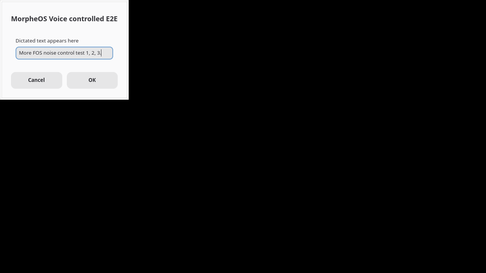

# MorpheOS Voice rebrand test results

- **Source branch:** `rebrand/morpheos-voice`
- **Baseline:** `f3879ee06fdb2df5b0728130cfcbc47221590334`
- **Environment:** Fedora x86-64 worker, 18 July 2026
- **Publication:** not performed

## Summary

| Area | Result | Evidence |
|---|---|---|
| Public identity and copy | PASS | Brand constants/tests, desktop UI contract tests, website validator, package metadata and deliberate old-name scan |
| Existing-user state contract | PASS | Legacy ProjectDirs identity test plus settings/shortcut/model round trip without deletion |
| Core Rust | PASS | Format, strict Clippy and 71 passing tests; 2 hardware/clipboard tests intentionally ignored |
| Desktop UI contract | PASS | 16 Python tests and JavaScript parse checks |
| Desktop shell boundary | PARTIAL | 2 shell tests and a complete source type-check pass; native Fedora build is blocked by missing WebKitGTK 4.1/libsoup development metadata |
| Website | PASS | Three-page validator plus Chrome desktop/mobile interaction and layout checks |
| Linux packages | PARTIAL | Debian/RPM generation, metadata and extracted-binary smoke pass; local Fedora build is not the release workflow's Ubuntu 22.04 compatibility build |
| Linux controlled dictation | PASS | Real `arecord`/PipeWire → local Whisper.cpp → clipboard → focused GTK insertion → history equality |
| Linux physical microphone/hotkey | BLOCKED | Hardware is visible, but the controlled test used a temporary source and socket start/stop rather than a person pressing the physical shortcut |
| macOS current candidate | BLOCKED | No native current-branch build, signing, permission or physical insertion run in this environment |
| Windows current candidate | BLOCKED | No native current-branch build, signing, permission or physical insertion run in this environment |
| Remote transcription | PARTIAL | Validation/redaction/failure unit coverage passes; no live provider request was made |
| First-run onboarding | PARTIAL | CLI setup selection tests pass; the Tauri embedded first-run path still reports Needs Attention rather than completing native onboarding |
| Dependency security | PARTIAL | RustSec reports no unignored vulnerability after the two documented exceptions; 22 unmaintained/unsound warnings remain accepted migration debt |
| Licence inventory | PASS | Every locked Cargo package reported a licence expression; original source MIT boundary and separate model licences are documented |

## Commands and observed results

### Core and static checks

```text
cargo fmt --all                                  PASS
cargo clippy --locked --all-targets -- -D warnings
                                                 PASS
cargo test --locked --no-default-features        PASS: 71 passed, 2 ignored
cargo test --locked -p oswispa-desktop --no-default-features
                                                 PASS: 2 passed
python3 -m unittest discover -s desktop/ui/tests -p 'test_*.py'
                                                 PASS: 16 passed
python3 scripts/check_website.py                 PASS: 3 HTML pages
node --check website/app.js and desktop UI JS    PASS
bash -n + tests/install_helpers.bash             PASS
desktop-file-validate packaging/linux/oswispa.desktop
                                                 PASS
PyYAML parse of workflows and issue forms        PASS: 9 files
git diff --check                                 PASS
```

Strict Clippy included the Linux GTK feature path. The core test suite specifically covered the new public identity, retained `oswispa` CLI contract, one legacy storage identity and an existing settings/shortcut/model round trip with no deletion.

### Native desktop boundary

`cargo check --locked -p oswispa-desktop` stopped before application code because Fedora lacks `libsoup-3.0` and `javascriptcoregtk-4.1` pkg-config metadata. A temporary proof-only pkg-config shim then allowed `cargo check` to type-check the complete Tauri/Tauri single-instance source successfully. This is source/API evidence only and is not counted as a native runtime PASS.

### Linux package proof

- Release build with Linux GTK: PASS.
- `cargo deb --locked`: package produced; Fedora lacks `dpkg-shlibdeps`, so automatic Debian shared-library discovery was unavailable locally. Explicit runtime-tool dependencies are present.
- `cargo generate-rpm`: package produced with shared-library and required runtime-tool metadata.
- Extracted Debian binary smoke: PASS.
- Extracted RPM binary smoke: PASS.
- Both reported `OSWISPA_PLATFORM_SMOKE_OK version=0.4.2 os=linux arch=x86_64` and the expected Linux audio/hotkey/input backends.
- Packaged desktop entry validates and displays `Name=MorpheOS Voice`.

The package/executable filenames remain `oswispa` deliberately. The locally built Fedora RPM requires GLIBC 2.39 and is test evidence, not a broadly compatible release artefact. The protected Ubuntu 22.04 workflow must build the public packages.

### Controlled Linux end to end

Input WAV phrase:

> MorpheOS Voice controlled test one two three.

Observed local `base.en` transcript:

> More FOS noise control test 1, 2, 3.

Observed text copied back from the focused GTK field:

> More FOS noise control test 1, 2, 3.

The wording is not perfectly accurate, but the real delivery contract passed: the transcript was non-empty, local history and the visible field matched exactly, and the temporary PipeWire device/processes were removed. The run used isolated XDG paths and did not modify the user's normal MorpheOS Voice/OSWispa state.



### Browser proof

Chrome/Playwright checks at 1440 × 1100 and 390 × 844 found:

- no horizontal overflow;
- no console errors;
- primary CTA above the fold at both sizes;
- working mobile menu and Escape close;
- all reveal sections visible after scrolling; and
- local icon, CSS, JavaScript and favicon requests successful.

### Dependency audit

```text
cargo audit --ignore RUSTSEC-2026-0194 --ignore RUSTSEC-2026-0195
```

Result: no unignored vulnerability; 22 allowed warnings. The two ignored `quick-xml` advisories and the unmaintained/unsound transitive warnings remain documented debt. No change in this rebrand makes those warnings safe to omit from release review.

## Not proved

- Physical microphone capture or a physical global shortcut.
- Native permission prompts or persistence across upgrades.
- macOS/Windows current-branch build and full dictation.
- Signing, notarisation, installer upgrade/uninstall or rollback.
- A live remote transcription request.
- Offline behaviour with the network forcibly removed.
- Crash recovery of in-progress audio; the product does not provide it.
- Public GitHub Release assets or deployed `morpheos.net/voice` downloads.
